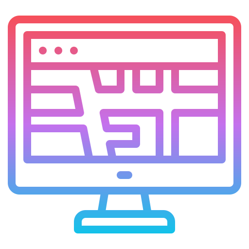

<h2 align="center">My Portfolio Website</h2>

<p align="center">
   
</p>

<p align='center'> 
   
   
   
   
   <br>
   
   </a><br>
</p>
<p align="center">
  <a href="https://github.com/sandip2224/My_Portfolio_Website"><strong>Explore the docs »</strong></a>
</p>

<!-- PROJECT LOGO -->
  <p align="center">
    <br />
    <a href="https://github.com/sandip2224/My_Portfolio_Website">View Demo</a>
    ·
    <a href="https://github.com/sandip2224/My_Portfolio_Website/issues">Report Bug</a>
    ·
    <a href="https://github.com/sandip2224/My_Portfolio_Website/issues">Request Feature</a>
  </p>

<!-- TABLE OF CONTENTS -->
<h2 align="center">Table of Contents</h2>

- [About the Project](#about-the-project)
  - [Preview](#preview)
  - [Built With](#built-with)
- [Getting Started](#getting-started)
  - [Prerequisites](#prerequisites)
  - [Installation](#installation)
- [Usage](#usage)
- [License](#license)
- [Contributing](#contributing)
- [Contact](#contact)
- [Acknowledgements](#acknowledgements)


<!-- ABOUT THE PROJECT -->

<h2 align="center">About the Project</h2>


This portfolio website has been handcrafted with HTML markup, CSSS styling and Bootstrap classes. It features 5 different sections including a dedicated `homepage`, a `Projects` section, an `About Me` section, a `Skills` page as well as a dedicated `footer` section.


Here's why it's so awesome:  

- ***The website presents a consistency in color palette including a shade of blue and yellow.*** 😁  
- ***The website is fully responsive and scales down perfectly on smaller viewports.*** ✅  
- ***The website clearly showcases my achievements as well as my personal projects without ambiguity.*** 🖖  

> I also encourage you to suggest changes by forking this repository and creating a pull request or opening an issue.  

<!-- Preview -->
<h2 align="center">Preview</h2>

<p align="center"></p>

<!-- BUILT WITH -->  

<h2 align="center">Built With</h2>

<p align="center">
  
  
  
  
</p>  


<!-- GETTING STARTED -->

<h2 align="center">Getting Started</h2>

To get a local copy up and running follow these simple example steps as mentioned based on your project.  


<!-- PREREQUISITES -->

<h2 align="center">Prerequisites</h2>

This is an example of how to list things you need to set up the project and get it running:  

- [x] HTML 5 markup
- [x] CSS 3 styling
- [x] JavaScript basics
- [x] Bootstrap grid system


<!-- INSTALLATION -->
<h2 align="center">Installation</h2>

1. Fork and clone this repository using  

```bash
  git clone https://github.com/sandipan_2224/My_Portfolio_Website.git
  cd My_Portfolio_Website
```  

2. Open the html file in VSCode using  

```bash
  code index.html
```

3. Execute the `index.html` script either using live server in VSCode.  

<!-- USAGE -->

<h2 align="center">Usage</h2>

- It offers a professional way to showcase our work.  
- It helps increase our visibility and online presence.  
- It shows that we offer more than just our resume.  

_For more examples, please refer to the [Documentation](https://careerhub.adelaide.edu.au/students/news/detail/361/5-benefits-of-creating-online-)_  


<!-- LICENSE -->  

<h2 align="center">License</h2>

Distributed under the MIT License. See `LICENSE` for more information.  


<!-- CONTRIBUTING -->
<h2 align="center">Contributing</h2>

Contributions are what make the open source community such an amazing place to be learn, inspire, and create. Any contributions you make are **greatly appreciated**.

1. Fork the Project
2. Create your Feature Branch (`git checkout -b feature/AmazingFeature`)
3. Commit your Changes (`git commit -m 'Add some AmazingFeature'`)
4. Push to the Branch (`git push origin feature/AmazingFeature`)
5. Open a Pull Request  


<!-- CONTACT --> 

<h2 align="center">Contact</h2>

- **Hey guys, I'm Sandipan. Find out more about me** [ here](https://linkedin.com/in/sandipan0164)  
- **Reach out to me at** [ sandipan2224@gmail.com](sandipan2224@gmail.com)  


<!-- ACKNOWLEDGEMENTS -->

<h2 align="center">Acknowledgements</h2>

* [GitHub Shields](https://shields.io)
* [GitHub Pages](https://pages.github.com)
* [GitHub Emoji Cheat Sheet](https://www.webpagefx.com/tools/emoji-cheat-sheet)

<h3 align="right">Built with :heart: by <em>Sandipan Das</em></h3>
