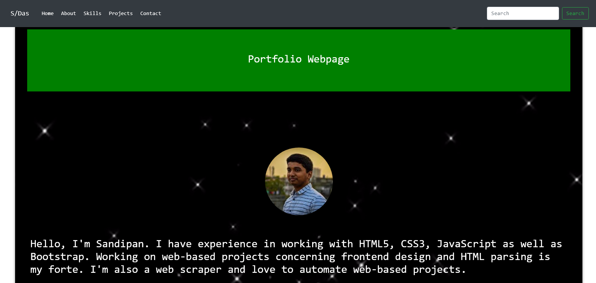

<h1 align="center">:sparkles:My Portfolio Webpage:sparkles:</h1>

  
  
  
  
  
  

<h2 align="center">Webpage Preview</h2>

    <a href="https://github.com/sandip2224/My_Portfolio_Website/issues/new/choose">Report Bug&nbsp;&nbsp;&nbsp;&nbsp;</a>
    <a href="https://github.com/sandip2224/My_Portfolio_Website/issues/new/choose">Request Feature</a>

<h2 align="center">Live website link:<a href="https://minimalninja.herokuapp.com">&nbsp;Click here</a></h2>

<h2 align="center"><strong>:point_right:𝚁𝚎𝚚𝚞𝚒𝚛𝚎𝚖𝚎𝚗𝚝𝚜</strong></h2>

1. HTML

2. CSS

3. Javascript

4. jQuery
 

5. Bootstrap
 

<h2 align="center"><strong>:point_right:𝙳𝚎𝚜𝚌𝚛𝚒𝚙𝚝𝚒𝚘𝚗</strong></h2>

𝚃𝚑𝚒𝚜 𝚠𝚎𝚋𝚜𝚒𝚝𝚎 𝚒𝚜 𝚑𝚊𝚗𝚍𝚌𝚛𝚊𝚏𝚝𝚎𝚍 𝚘𝚗 𝙷𝚃𝙼𝙻, 𝙲𝚂𝚂, 𝙹𝚊𝚟𝚊𝚜𝚌𝚛𝚒𝚙𝚝, jQuery and Bootstrap. 𝙸𝚝 𝚏𝚎𝚊𝚝𝚞𝚛𝚎𝚜 𝚊 𝚖𝚒𝚗𝚒𝚖𝚊𝚕 𝚑𝚘𝚖𝚎𝚙𝚊𝚐𝚎, 𝚊𝚗 "𝙰𝚋𝚘𝚞𝚝 𝙼𝚎" 𝚜𝚎𝚌𝚝𝚒𝚘𝚗, 𝚖𝚢 𝚜𝚔𝚒𝚕𝚕𝚜, 𝚖𝚢 𝚖𝚒𝚗𝚒-𝚙𝚛𝚘𝚓𝚎𝚌𝚝𝚜, awards 𝚙𝚕𝚞𝚜 𝚙𝚎𝚛𝚜𝚘𝚗𝚊𝚕 𝚍𝚎𝚝𝚊𝚒𝚕𝚜 𝚠𝚒𝚝𝚑 𝚊𝚍𝚍𝚎𝚍 𝚕𝚒𝚗𝚔𝚜 𝚝𝚘 𝚖𝚢 𝚜𝚘𝚌𝚒𝚊𝚕 𝚖𝚎𝚍𝚒𝚊 𝚜𝚒𝚝𝚎𝚜. I've also included a non-functional 'Contact Me' near the end. 𝚃𝚑𝚎 𝚎𝚗𝚝𝚒𝚛𝚎 𝚠𝚎𝚋𝚜𝚒𝚝𝚎 𝚒𝚜 𝚐𝚊𝚛𝚗𝚒𝚜𝚑𝚎𝚍 𝚋𝚢 𝚊 𝚜𝚖𝚘𝚘𝚝𝚑 𝚜𝚌𝚛𝚘𝚕𝚕 𝚎𝚏𝚏𝚎𝚌𝚝 𝚠hich 𝚊𝚍𝚍𝚜 𝚝𝚘 𝚞𝚜𝚎𝚛-𝚌𝚘𝚖𝚏𝚘𝚛𝚝 𝚊𝚗𝚍 𝚒𝚗𝚝𝚎𝚛𝚊𝚌𝚝𝚒𝚟𝚒𝚝𝚢.

<h2 align="center"><strong>:point_right:𝙲𝚂𝚂 𝚜𝚘𝚞𝚛𝚌𝚎 𝚏𝚒𝚕𝚎𝚜</strong></h2>

1. style.css

<h2 align="center"><strong>:point_right:𝙸𝚖𝚐 𝚜𝚘𝚞𝚛𝚌𝚎 𝚏𝚒𝚕𝚎𝚜</strong></h2>

1. img/1.PNG

2. img/1.jfif

<h4 align="right">Built & designed by <strong>Sandipan Das</strong></h4>

